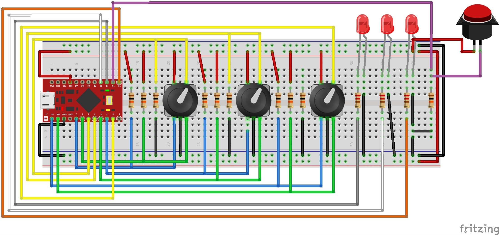

# **Vol-Box**
> A fairly simple project to create a 'USB Volume Control Box' using an Arduino Pro Micro 5v clone and AutoHotKey scripts. As well as integrating my Logitech X-240's original remote controller PCB and the bass control knob from the back of the sub box (such a horrid deisgn..) into the same enclosure as the Arduino.

### The Plan: 
 centralize ALL audio controls into one small(ish) space on my desk. Including:
   * Main volume control for Logitech X-240 speakers
   * Bass volume control for Logitech X-240 sub woofer
   * Main volume control and mute for computer via USB (done using NicoHood's HID library)
   * Google Chrome volume control and mute via USB (done using AutoHotkey Scripts)
   * Customizable game volume control and mute via USB (done using AutoHotkey Scripts)
   * 3x LEDs to show muted states of rotary encoders
   * Push button to change audio output/source (done using SoundSwitch)
### Why:
   * the lightweight, always in the way or always falling off the back of my desk, often unreachable remote control for my Logitech X-240 speakers really doesn't fit at all into my computer setup and is often pushed off to the back of my desk behind the monitors and the control for the bass is located on the back of the sub box, which is also often pushed to the back of my desk making it very, very difficult to adjust the bass
   * also being as I watch a lot of Netflix and am often forced into changing the volume of whatever I'm watching via the slider given with the player, again this is a hassle.. wouldn't it be great just to have a knob to adjust the volume of Google Chrome within the volume mixer? I think it would! 
   * another problem I'm often faced with is adjusting the volume of fullscreened games.. this can be such a headache! The solution.. a knob to adjust the volume of whatever game (will have a short setup process due to having to change scripts around to your needs) I'm playing at the time within the volume mixer! 
   * sometimes you just have to adjust the master volume within the volume mixer.. soooo.. yet again, ANOTHER KNOB! Plus there's left over pins to play with! 

### Part One - Logitech X-240 Rework - 
#### Step One - 
  * Remove PCB from inside of sub box
  * Desolder original potentiometer (bass control)
  * Solder 3x 18g wires in place of original potentiometer, secure with hot glue (I ended up using a computer PSU power cable with the                                                                                     ends cut off)
  * Feed wire through back of box and put the PCB back in place
  
#### Step Two - 
  * Remove PCB from inside of the remote control
  * Desolder original sidewheel potentiometer (speaker volume) **BE CAREFUL! YOU MUST REMEMBER WHICH PINS WENT WHERE!**
  * Desolder original power LED
  * Solder 5x 24g wires in place of original potentiometer, secure with hot glue
  * Solder 2x 24g wires in place of original LED, secure with hot glue
  * Resecure original hot glue joints as they weren't secured very well
  * Cut 2x slots in the bottom of the enclosure to feed the PCB wires through
  
#### Step Three -
  * Drill appropriate holes in front of enclosure 
  * Mount PCB standoffs to controller board and secure to inside of enclosure with hot glue
  * Solder the other ends the 5x 24g wire to a dual-gang (stereo) potentiometer, jump the ground pins together **BE CAREFUL! THE PINOUT                                                                       ON THE BOARD IS REVERSED DUE TO CCW ROTATION TO TURN VOLUME UP!**
  * Solder the other ends of the 2x 24g wire to an orange panel-mount LED
  * Solder the other end of the new cable coming from the back of the sub box to a 10k Ω LOG potentiometer
  * Secure potentiometers and LED to front of enclosure
  * Close up and test out! 

### Part Two - Arduino USB Volume Control Project -

#### Step One -
  * Finish me! 

#### Bill of Materials (for Part One) -
##### LEDs - 
   * 1x Orange LED (panel-mount)
##### Electromechanical - 
   * 1x 10k Ω LOG potentiometer
   * 1x 10k Ω LOG DUAL-GANG (STEREO) potentiometer
##### Other - 
   * 4x PCB standoffs
   * 2x Knobs
   * 1x Enclosure (both the Arduino part and Logitech part will go in the same enclosure)

#### Bill of Materials (for Part Two) -
##### Microcontroller -
   * Arduino Pro Micro (5V, 16MHz)
##### Resistors - 
   * 10x 10k Ω
   * 3x 220 Ω
##### LEDs - 
   * 3x Red LEDs (panel-mount)
##### Electromechanical - 
   * 2x SPST MOM NO push button (1x for Source and 1x for Arduino Reset)
   * 3x Rotary encoders with switches (5-pin)  
##### Other - 
   * 4x PCB standoffs
   * 3x Knobs
   * 1x Enclosure

## Installation -

### Windows:
1. Download and install the Arduino IDE - (LINK)
2. Download and install SoundSwitch (optional) - (LINK)
3. 

### OS X & Linux:
1. idk...

## Arduino Code -
(LINK)

## Release History -

* **0.0.3 - Sep 01, 2017**
    * Update: README.TXT
    * Add: Third LED to Arduino Code
    * Add: Third rotary encoder to Arduino Code
    * Add: 'VA.ahk' to: '...\Resources'
    * Add: 'panic-button.ahk', press esc to terminate all running AHK scripts
    * Add: 'chrome-vc.ahk' to: '...\Code\AutoHotKey Scripts'
    * Add: 'dirt_rally-vc.ahk' to: '...\Code\AutoHotKey Scripts'
    * Add: 'dirt_4-vc.ahk' to: '...\Code\AutoHotKey Scripts'
    * Remove: 'chrome-nomute.ahk'
    * Remove: 'dirt_rally-nomute.ahk'
    * Remove: 'dirt_4-nomute.ahk'
    
* **0.0.2 - Aug 31, 2017**
    * Add: 'chrome-nomute.ahk' to: '...\Code\AutoHotKey Scripts'
    * Add: 'dirt_rally-nomute.ahk' to: '...\Code\AutoHotKey Scripts'
    * Add: 'dirt_4-nomute.ahk' to: '...\Code\AutoHotKey Scripts'
    
* **0.0.1 - Aug 29, 2017**
    * Work in progress

## Meta -

Kyle Gilmour – [@YourTwitter](https://twitter.com/dbader_org) – winsimdevices@gmail.com

Distributed under the MIT license. See ``LICENSE`` for more information.

[https://github.com/winsim/Vol-Box](https://github.com/winsim/Vol-Box/)

<!-- Markdown link & img dfn's -->
[wiki]: https://github.com/winsim/Vol-Box/wiki
